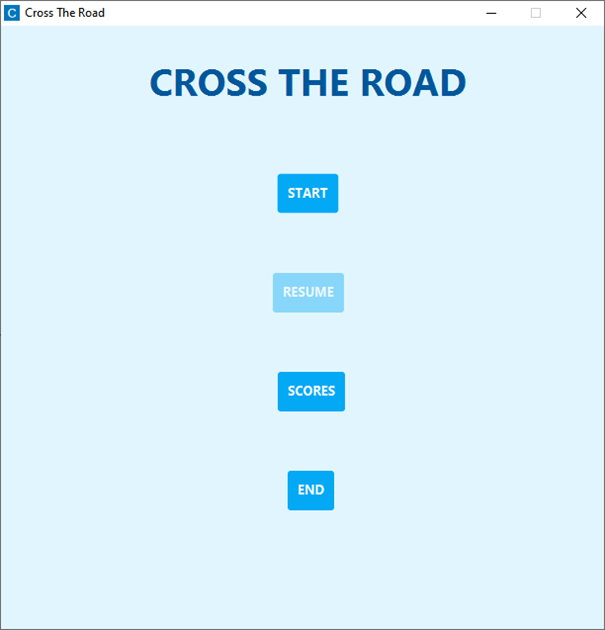
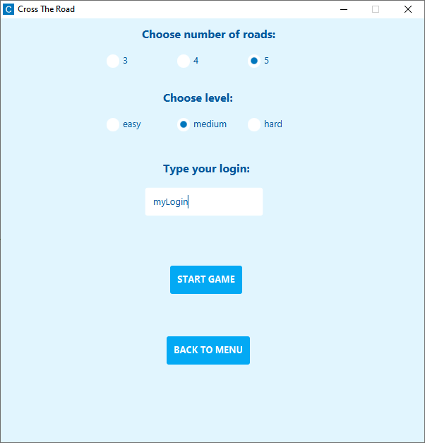
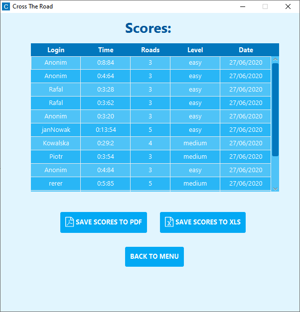
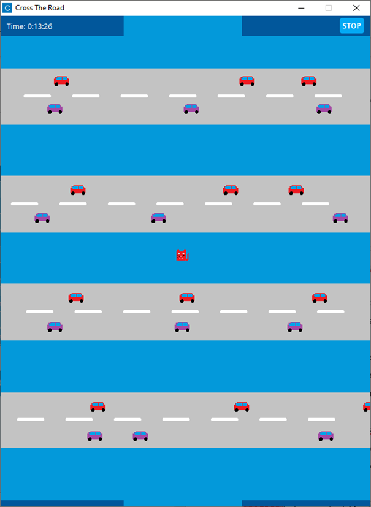
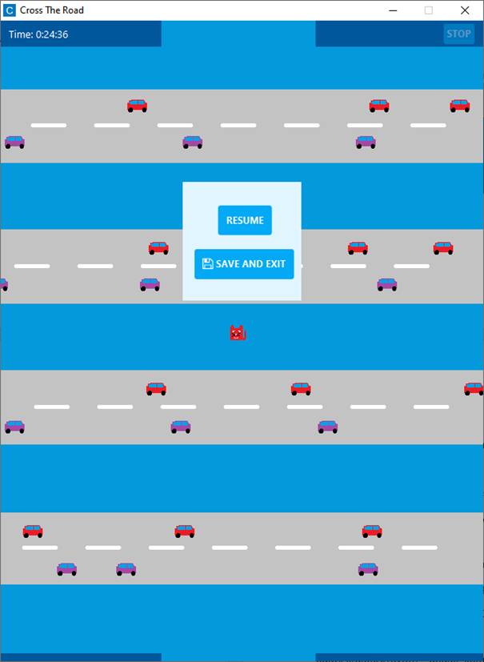

# Cross The Road
Cross The Road is a desktop game. Player has to control a cat to cross all the roads in the shortest time. Game has three difficulty levels and three possible roads number configurations. Application offers gamme saving and loading, saving scores to pdf and xls files.

## Technologies
* Java 8
* JavaFX
* CSS
* Maven

## Libraries
* log4j
* org.json
* com.itextpdf
* org.apache.poi 
* de.jensd:fontawesomefx

## Application View
### Main menu

### Start Menu

### Scores Menu

### Game View

### Pause View

